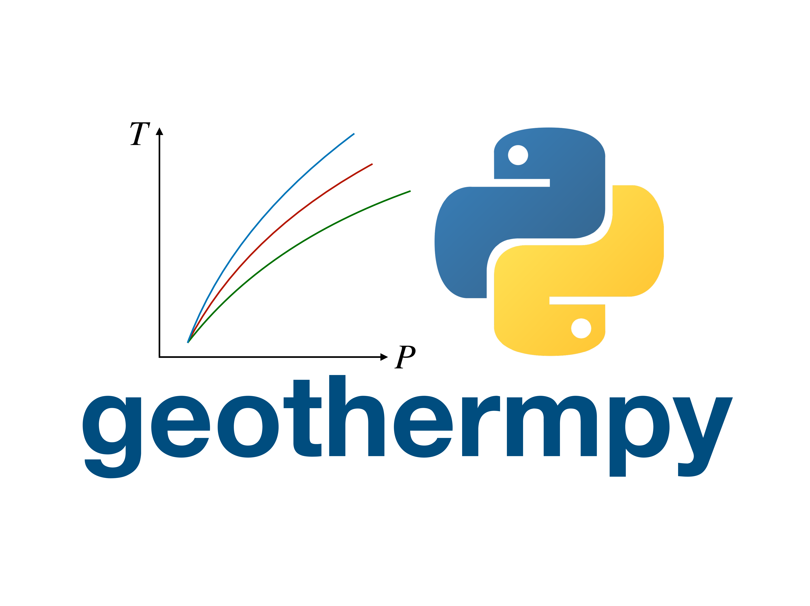

==========
geothermpy
==========

A Python package that can calculate the isentropic geotherm from thermodynamic properties

Description
===========

For corresponding paper, please have a look at [Ref. 1.]_.

References
==========

.. [Ref. 1.] Cardona, J. J. V. *et al.* Influence of the iron spin crossover in ferropericlase on the lower mantle geotherm. *Geophysical Research Letters* **44,** 4863–4871 (2017).
